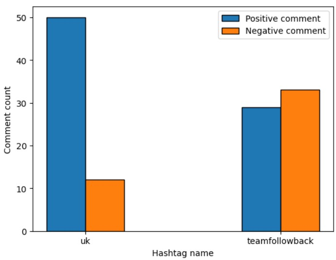

# P4DS_Final-Project

## I. Thông tin thành viên
* Môn học: Lập trình cho khoa học dữ liệu-CSC17104_21KHDL1

| Họ và tên  | MSSV  |
|    ---     | ---   |
| Đặng Minh Đức  | 20127136  |
| Bùi Tiến Đạt  | 20127130  |
| Nguyễn Trương Hoàng Thái  | 20127625  |

## II. Nội dung của đồ án 
### 1. Bộ dữ liệu
[FPL Tweets Dataset](https://www.kaggle.com/datasets/prasad22/fpl-tweets-dataset) chứa thông tin của 114466 Tweets từ năm 2012 đến 2023.

### 2. Meaningful questions
#### 1. Các tài khoản đã xác minh thường sử dụng nguồn nào để đăng tweet? ####
* **Mục đích**: Khám phá các ứng dụng hoặc thiết bị mà các tài khoản đã xác minh thường sử dụng để đăng tweet về FPL. 
#### 2. Vào năm 2023, khung giờ đăng các tweets của top 10 người có số lượng followers nhiều nhất thường phổ biến nhất vào lúc nào?  ####
* **Mục đích**: Xác định thời gian (khung giờ) phổ biến nhất mà các tài khoản có nhiều người theo dõi thường đăng tweet về FPL. 
#### 3. Các user nào không được xác minh mà sở hữu  top 10 tweets có lượng tương tác nhiều nhất? ####
* **Mục đích**: Xác định liệu rằng các tài khoản không được xác minh viết tweet có nhiều lượng tương tác nhất thì nội dung có chính xác hay không. Từ đó có thể phân tích xu hướng cộng đồng của mọi người hướng đến những tài khoản không xác minh này. 
#### 4. Qua từng năm, những hashtag nào được tương tác nhiều nhất của các tài khoản được xác minh?  ####
* **Mục đích**: Giúp ta hiểu rõ về chiến lược truyền thông, nắm bắt xu hướng cộng đồng, tối ưu hóa nội dung, hơn thế nữa có thể dự đoán xu hướng tương lai. 
#### 5. Thái độ hưởng ứng của cộng đồng đối với các sự kiện (hashtag) ####
* **Nội dung**: khảo sát thái độ (tích cực, tiêu cực) của cộng đồng đối với các sự kiện phổ biến đã được tổ chức cho tựa game FPL.
* **Mục đích**: dựa vào kết quả khảo sát, nhà phát hành có thể tiếp tục phát triển những sự kiện tích cực (mang lại giá trị cao) và hạn chế các sự kiện tiêu cực (các sự kiện nổi lên vì tai tiếng).

### 3. Phân tích các câu hỏi
#### 1. Các tài khoản đã xác minh thường sử dụng nguồn nào để đăng tweet? ####
- **Phân tích:**
    - Đầu tiên, tìm những tài khoản nào nào có ``Verified_Account`` là ``True`` (những tài khoản đã được xác minh).
    - Đếm số lượng tài khoản đã xác minh đó dựa vào ``Source``. Các nguồn thường được các tài khoản đã xác minh cũng chính là top 3 số lượng tài khoản đã xác minh dựa vào ``Source`` cao nhất.

- **Kết quả:** Các tài khoản được xác minh thường sử dụng ứng dụng TweetDeck và Twitter từ Web Client hoặc thiết bị iPhone (TweetDeck, Twitter Web Client và Twitter for iPhone).

#### 2. Vào năm 2023, khung giờ đăng các tweets của top 10 người có số lượng followers nhiều nhất thường phổ biến nhất vào lúc nào?  ####
- **Phân tích:**
    - Tìm những tweets được đăng vào năm 2023
    - Tìm những tài khoản có top 10 số lượng followers nhiều nhất
    - Phân tích số lượng followers cũa mỗi tweet dựa vào khung giờ và chọn ra số lượng lớn nhất.

- **Kết quả:**
    - Vào năm 2023, khung giờ mà top 10 người có số lượng followers nhiều nhất đăng các tweets thường phổ biến nhiều nhất là từ 12 giờ đến trước 13 giờ.
    - Vào năm 2023, từ 1 giờ đến trước 7 giờ và từ 21 giờ đến trước 0h không có một lượt tương tác nào vì hai khung thời gian này thường họ ngủ hoặc đang làm việc đêm.

#### 3. Các user nào không được xác minh mà sở hữu  top 10 tweets có lượng tương tác nhiều nhất? ####
- **Phân tích:**
    - Lọc những tài khoản ``Verified_Account`` là ``True`` (những tài khoản đã được xác minh).
    - Đếm số lượng tương tác (Tổng của ``Likes``, ``Replies``, ``Retweets``) 
    - Chọn top những tài khoản có lượng tương tác ở tweet lớn nhất (1 tài khoản có thể có nhiều tweet).

- **Kết quả:**

#### 4. Qua từng năm, những hashtag nào được tương tác nhiều nhất của các tài khoản được xác minh?  ####
- **Phân tích:**
    - Tách những ``Hashtag`` gộp (1 ``Hashtag`` là ['ITsupport', 'Tech'] sẽ thành 2 ``Hashtag`` ['ITsupport'],[ 'Tech'])
    - Lọc những tài khoản ``Verified_Account`` là ``True`` (những tài khoản đã được xác minh).
    - Đếm số lượng tương tác (``Likes``, ``Replies``, ``Retweets``) 
    - Chọn top 3 ``Hashtag`` có lượng tương tác lớn nhất mỗi năm

- **Kết quả:**

#### 5. Thái độ hưởng ứng của cộng đồng đối với các sự kiện (hashtag) ####
- **Phân tích:**
    - Tạo một dataframe với các cột `['hashtag_name', 'count', 'positive_text', 'negative_text']` với: `hashtag_name`: tên của hashtag và độc nhất cho mỗi sự kiện; `count`: số lần hashtag xuất hiện trong tất cả tweet, giúp xác định độ phổ biến của hashtag; `positive_text` và `negative_text` lần lượt là số lượng bình luận tích cực và tiêu cực của cộng đồng đối với hashtag.
    - Quy trình thực hiện: bước 1 - tìm và đếm số lần xuất hiện của các hashtag. Bước 2 - tìm và phân loại (sentiment analysis) nội dung của các tweet có hashtag tương ứng.
    - Vẽ biểu đồ cột đôi trực quan cho kết quả đạt được.

- **Kết quả:**

### 4. Tổng kết
1. Khó khăn khi thực hiện đồ án
* Thái:
    * Chưa thành thạo trong việc sử dụng các công cụ hỗ trợ và thư viện lập trình.
    * Quá trình phân tích câu hỏi về dữ liệu còn nhiều hạn chế.
* Đạt:
* Đức:
    * Chưa thành thạo trong việc sử dụng các công cụ hỗ trợ và thư viện lập trình.
    * Chưa thành thạo trong việc tạo nhánh trong Github, phải nhờ Thái tạo giùm.
    * Khó khăn trong việc quản lý thời gian thực hiện đồ án, cụ thể phải cân bằng với deadline của môn khác.
    * Khó khăn trong việc đặt câu hỏi sao cho có nghĩa cũng như quá trình phân tích câu hỏi về dữ liệu còn nhiều hạn chế.
2. Kiến thức đạt được sau khi thực hiện đồ án
* Thái:
    * Nắm được quy trình xử lý dữ liệu cơ bản: collect data - explore data - asking meaningful questions - analyze data.
    * Hiểu được sự quan trọng của quá trình tiền xử lý dữ liệu.
    * Sử dụng cơ bản các thư viện pandas, numpy, matplotlib và các công cụ Git (Github), WSL, Jupyter Notebook.
* Đạt:
* Đức:
    * Nắm được quy trình xử lý dữ liệu cơ bản: collect data - explore data - asking meaningful questions - analyze data.
    * Hiểu được sự quan trọng của quá trình tiền xử lý dữ liệu.
    * Sử dụng cơ bản các thư viện pandas, numpy, matplotlib và các công cụ Git (Github), WSL, Jupyter Notebook.
    * Biết được cách sử dụng Trello trong việc quản lý thời gian thực hiện đồ án.
3. Ý tưởng phát triển nếu có thêm thời gian
* Finetune mô hình được huẩn luyện sẵn từ Hugging Face để đạt được độ chính xác cao hơn.
* Điều chỉnh các đồ thị để phù hợp hơn trong việc trực quan kết quả tính toán.
* Sử dụng mô hình ngôn ngữ lớn (Large Language Model) cho việc phân tích cảm xúc của từng tweets được đăng bởi một tài khoản nào đó.

## III. Kế hoạch thực hiện
- [Trello](https://trello.com/invite/b/DNhvft8O/ATTI383acbc1dec94db2598dbbb3a5d06887A9124805/chim-da-da-p4ds)
- [Google Sheets](https://docs.google.com/spreadsheets/d/1pbR2yj6GvzOqSXhwOUz4eFgmFEfkTJamexI0saJP_dY/edit?usp=sharing)

## IV. Nguồn tham khảo
* Dataset
https://www.kaggle.com/datasets/prasad22/fpl-tweets-dataset

* Pandas documentation
https://pandas.pydata.org/docs/reference/index.html

* Numpy documentation
https://numpy.org/doc/stable/reference/index.html#reference

* Matplotlib reference
https://matplotlib.org/stable/api/index.html

* Hugging Face sentiment analysis
https://huggingface.co/blog/sentiment-analysis-python

* Github repository
https://github.com/lengoctuong/Prj-Manga-Dataset_Programming4DS

* Nội dung các bài lab của môn học.